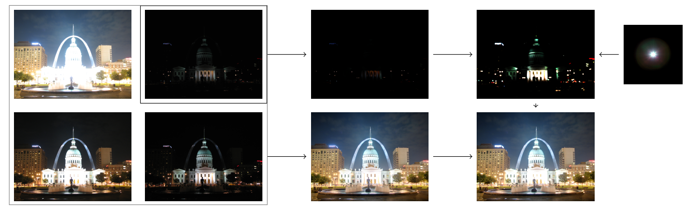

# Tonemap and Bloom
Tonemap and Bloom is an algorithm created for the research project of the Computer Science and Engineering bachelor of Delft University of Technology. 

When you want to display an image with a higher dynamic range than your camera can pick up, you can take multiple pictures with different exposure rates, and merge them using a process called tone mapping. This creates a picture with detail in both bright and dark areas. Tonemap and Bloom was created for the research project of the bacherlor, and extends on existing tone mapping algorithms by making the brightest areas emit a glow. To do this, we use the bloom shader effect, an effect often used in video games. We take the image with the lowest exposure value, and perform convolution on it with a given kernel. For a realistic effect, this kernel should be similar to a camera’s response to a single point of light.

There are also several parameters. The smoothing factor changes how bright a pixel needs to be to emit a significant glow. The bloom intensity changes the intensity of the glow when it's merged with the tone mapped image. Finally, the kernel size determines the spread of the glow.

A full overview of the technique can be seen below:

*Original images by Kevin McCoy, kernel by Unreal Engine*

The paper can be found [here](https://repository.tudelft.nl/islandora/object/uuid%3A86f2fd9a-bc48-4803-814f-3b0f83d39ea8?collection=education).

## Code Structure
The code consists of four parts. `tonemap_and_bloom.py` is the general algorithm, along with some helpful tools such as image saving and loading. `main.py` runs the algorithm and saves it in the img folder. `application.py` is a Kivy user interface to run the algorithm more easily. The last image created is stored in img/app_output. Finally, `time.py` output the average runtime for an image.

## Requirements
- Python 3
- OpenCV2
- NumPy
- SciPy
- Kivy (for running the application only)
